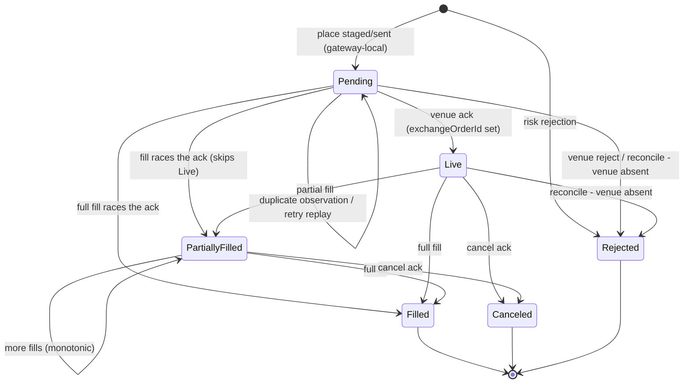
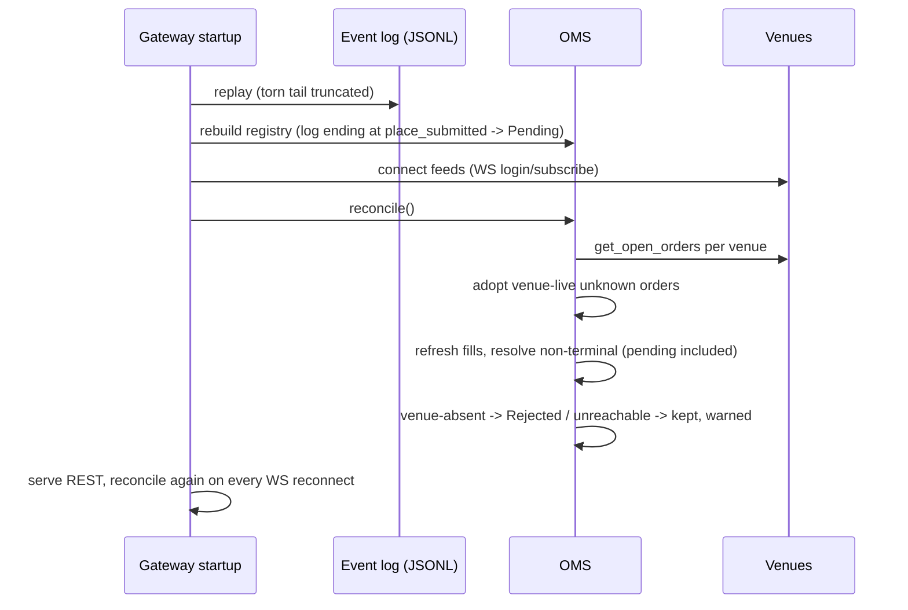

# REST API — Minimal Reference

Exchange-agnostic order API. One schema for OKX and Binance; the `venue`
field routes. Content-Type is `application/json` on every response.
Source of truth for behavior: `src/rest/order_routes.cpp`.

## Endpoints

| Method | Path | Purpose |
|---|---|---|
| POST | `/orders` | place order (limit/market) |
| GET | `/orders` | list all orders (registry snapshot) |
| GET | `/orders/{clientOrderId}` | order status (registry view) |
| DELETE | `/orders/{clientOrderId}` | cancel (idempotent) |
| PUT | `/orders/{clientOrderId}` | amend (price and/or quantity) |
| GET | `/price/{symbol}` | last-traded price (`?venue=`, default venue) |
| GET | `/risk` | active pre-trade risk limits (read-only) |
| GET | `/health` | liveness + registry stats |

## Error envelope

Every error is a JSON object, whatever the status code:

```json
{"error": {"code": "<machine-readable>", "reason": "<human-readable>", "clientOrderId": "<or empty>"}}
```

Codes: `invalid_request`, `risk_max_qty`, `risk_max_notional`,
`risk_max_position`, `risk_invalid_value`, `not_found`, `order_pending`,
`order_terminal`, `venue_rejected`, `venue_unavailable`, `persistence`,
`internal`.

| HTTP | Code | Meaning |
|---|---|---|
| 400 | `invalid_request` | schema/field validation |
| 400 | `risk_*` | pre-trade risk rejection (reason carries the limit) |
| 404 | `not_found` | unknown clientOrderId (incl. venue "does not exist") |
| 409 | `order_pending` | cancel/amend before the venue acknowledged the order (no venue call) |
| 409 | `order_terminal` | cancel/amend on a filled/canceled/rejected order |
| 409 | `venue_rejected` | venue rejected the request (reason carries the venue code) |
| 502 | `venue_unavailable` | transport failure, outcome unknown or unresolved |
| 500 | `persistence` / `internal` | local failures after venue acceptance / bugs |

## POST /orders — place

Request fields (strict allowlist; unknown fields are a 400 that names them —
exchange-specific fields are rejected by design):

| Field | Req/Opt | Rules |
|---|---|---|
| `clientOrderId` | required | 1–32 chars, `[A-Za-z0-9]` only. Idempotency key: retrying a known id replays its recorded outcome verbatim |
| `venue` | optional | case-insensitive `OKX`/`BINANCE`; default from config |
| `symbol` | required | non-empty; gateway spelling `BTC-USDT` everywhere |
| `side` | required | `buy`/`sell` (case-insensitive) |
| `type` | required | `limit`/`market` (case-insensitive) |
| `price` | conditional | required for limit, forbidden for market; plain decimal (`^[0-9]+(\.[0-9]+)?$`) |
| `quantity` | required | plain decimal |
| `timeInForce` | optional | `GTC`/`IOC`/`FOK`; limit orders only; default GTC |

**201** (venue acknowledged the order — also for idempotent replays of an
acked outcome):

```json
{"clientOrderId": "gw0001", "exchangeOrderId": "12569099453", "symbol": "BTC-USDT",
 "venue": "OKX", "state": "live", "replayed": false}
```

**202** (still unacked — the venue call is in flight for this id, or a
previous attempt was transport-unresolved): `"state":"pending"` with an
empty `exchangeOrderId`. A concurrent duplicate POST replays this 202
rather than re-sending to the venue; once the venue acks, subsequent POSTs
replay the recorded 201 record:

```json
{"clientOrderId": "gw0001", "exchangeOrderId": "", "symbol": "BTC-USDT",
 "venue": "OKX", "state": "pending", "replayed": true}
```

`replayed: true` means no venue call was made — the recorded outcome was
served from the registry. A place is persisted (`place_submitted`) and
recorded `pending` *before* the venue call, so `GET /orders/{id}` returns a
working view of "we tried this id" even while the venue has not acked.

## GET /orders — list

**200**: full registry, sorted by clientOrderId. No pagination yet.

```json
{"orders": [ { …order record… }, … ]}
```

## GET /orders/{clientOrderId} — status

Served from the local registry (fed by WS execution reports + reconcile) —
no venue round-trip. **200**:

```json
{"clientOrderId": "gw0001", "exchangeOrderId": "12569099453", "symbol": "BTC-USDT",
 "venue": "BINANCE", "side": "buy", "type": "limit", "timeInForce": "GTC",
 "state": "partially_filled", "price": "30000", "quantity": "0.1",
 "filledQuantity": "0.04", "averageFillPrice": "29999.5"}
```

`filledQuantity`/`averageFillPrice` are empty until the first fill reports.
Orders in state `rejected` (listing and status view) additionally carry the
recorded reason that is replayed to idempotent retries:

```json
{"…": "…", "state": "rejected",
 "rejection": {"code": "risk_max_qty", "reason": "quantity 0.05 exceeds maxQty 0.01 for BTC-USDT"}}
```

Errors: 404 `not_found`.

## DELETE /orders/{clientOrderId} — cancel

Idempotent: canceling an already-canceled order returns 200 again without a
venue call. **200**:

```json
{"clientOrderId": "gw0001", "exchangeOrderId": "12569099453",
 "symbol": "BTC-USDT", "venue": "OKX", "state": "canceled"}
```

Errors: 404 `not_found`; 409 `order_pending` (venue has not acked — no
venue call); 409 `order_terminal` (filled/rejected);
409 `venue_rejected`; 502 `venue_unavailable`.

## PUT /orders/{clientOrderId} — amend

Body: `{"price": "30100"}` and/or `{"quantity": "0.2"}` (strict allowlist;
at least one required; `null` = unchanged). Risk checks re-run on the merged
values. On Binance this is emulated with cancel+replace (the exchangeOrderId
changes; the clientOrderId is stable). **200**:

```json
{"clientOrderId": "gw0001", "exchangeOrderId": "12569099454", "symbol": "BTC-USDT",
 "state": "live", "price": "30100", "quantity": "0.2"}
```

Errors: 400 `invalid_request`/`risk_*`; 404; 409 `order_pending`/
`order_terminal`/`venue_rejected`; 502.

## GET /price/{symbol} — last-traded price

Public venue market data passthrough (OKX `GET /api/v5/market/ticker`,
Binance WS-API `ticker.price`). Optional `venue` query parameter routes;
default venue when absent. **200**:

```json
{"symbol": "BTC-USDT", "venue": "OKX", "price": "61750.5"}
```

Errors: 400 `invalid_request` (unknown venue); 409 `venue_rejected`
(unknown instrument — reason carries the venue code, e.g. `venue:51001`);
502 `venue_unavailable`.

## GET /risk — active pre-trade limits

Read-only view of the pre-trade risk limits, fixed by the config file at
startup (no runtime mutation). Mirrors the config `risk` section: an
optional `default` block plus `instruments` entries — an entry replaces
the defaults wholesale. Every field is a decimal string; an empty string
disables that check for the scope; `"default": null` means no defaults
are configured (unlimited for instruments without an entry). **200**:

```json
{"default": {"maxQty": "10", "maxNotional": "1000000", "maxPosition": "10"},
 "instruments": {"BTC-USDT": {"maxQty": "5", "maxNotional": "", "maxPosition": "2"}}}
```

Known limitation: market orders skip `maxNotional` (no pre-trade price
feed; documented in `src/core/risk.hpp`).

## GET /health

**200**:

```json
{"status": "ok", "knownOrders": 3, "reportsApplied": 12, "reportsStale": 2}
```

`reportsStale` counts duplicate/out-of-order execution reports that were
safely discarded.

## Order states



`pending` is gateway-local: venue execution reports and snapshots never
carry it — only the OMS creates it (at place staging) and only venue
observations or restart reconciliation resolve it. `Pending → Canceled` is
illegal by design: you cannot cancel what the venue has not accepted
(cancel/amend of pending is `order_pending` / 409, never a venue call).

Illegal transitions (any edge not drawn) are discarded — never errors. That
one rule arbitrates duplicates, out-of-order WS messages and REST-vs-WS
races; `filledQuantity` is a monotonic high-water mark.

## Place: idempotency and unknown-outcome flow

```mermaid
sequenceDiagram
    participant C as Client
    participant R as REST layer
    participant O as OMS registry
    participant A as Venue adapter
    participant V as Exchange

    C->>R: POST /orders {clientOrderId, …}
    R->>O: place(request)
    alt clientOrderId already known
        O-->>C: recorded outcome, replayed=true (no venue call; pending → 202)
    else new order
        O->>O: pre-trade risk checks
        alt rejected
            O-->>C: 400 risk_*
        else pass
            O->>O: record Pending + persist place_submitted (BEFORE the send)
            O->>A: place (venue I/O outside registry lock)
            A->>V: place order
            alt ack received
                A-->>O: exchangeOrderId
                O->>O: Pending -> Live, append place_accepted
                O-->>C: 201 live
            else transport failure (outcome unknown)
                A->>V: lookup by clientOrderId
                alt found
                    A-->>O: synthesized ack
                    O-->>C: 201 live
                else conclusively absent
                    A->>V: re-send identical order
                else unresolved
                    O-->>C: 502 venue_unavailable (record stays pending;
                    retry replays 202, reconcile/report resolves it)
                end
            end
        end
    end
```

Three idempotency layers: (1) registry replay for known clientOrderIds,
(2) state-machine arbitration for racing/duplicate reports, (3) adapter
resolve-then-retry — no code path can double-place an order.

## Restart recovery


