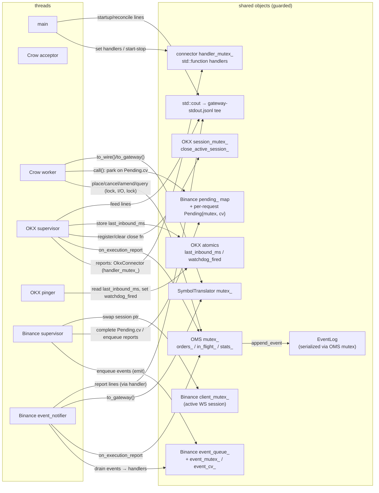

# Threads and Concurrency — `gateway` binary

How the release binary (`build/release/gateway`, launched by the compose
`gateway` service) distributes work across threads, and which objects the
concurrent threads share. Source of truth for behavior: `apps/gateway_main.cpp`,
`src/core/`, `src/exchange/{okx,binance}/`; third-party threads (Crow,
cpp-httplib) are described behaviorally, with our configuration knobs.

Verified live (both venues enabled): 8 threads —
`ls /proc/$(pidof gateway)/task | wc -l` inside the container.

## 1. Thread inventory

| # | Thread | Spawned by / site | Lifetime | Steady-state block |
|---|--------|-------------------|----------|--------------------|
| 1 | **main** | process entry (`apps/gateway_main.cpp`) | whole run | futex — parked in `join()` inside `app.run()` (apps/gateway_main.cpp:201) |
| 2 | **Crow acceptor** | `app.run()` → internal `std::thread` (third_party/crow_all.h:10687) | until server stop | epoll — asio loop accepting connections |
| 3 | **Crow worker** | `app.run()` → `std::async` worker, `concurrency(2)` → `2-1 = 1` (crow_all.h:10596, apps/gateway_main.cpp:201) | until server stop | epoll — handles one HTTP connection each |
| 4 | **OKX `supervisor_`** | `OkxOrdersFeed::start()` (src/exchange/okx/okx_ws_client.cpp:111) | `start()`→`stop()` | `poll()` — blocking WS `read()` |
| 5 | **OKX `pinger`** | per session, inside `run_session` (okx_ws_client.cpp:254) | one connect cycle | futex — `interruptible_sleep` between pings |
| 6 | **Binance `supervisor_`** | `BinanceWsClient::start()` (src/exchange/binance/binance_ws_client.cpp:117) | `start()`→`stop()` | `poll()` — blocking WS `read()` |
| 7 | **Binance `event_notifier_`** | `BinanceWsClient::start()` (binance_ws_client.cpp:116) | `start()`→`stop()` | futex — `event_cv_.wait` on the event queue |
| 8 | **Binance WS heartbeat** | cpp-httplib `WebSocket::start_heartbeat`, default 30 s ping interval (third_party/httplib.h:21480, :217) | one connect cycle | futex — `ping_cv_.wait_for` |

Counts by configuration ( Crow is always 3 ):

| Configuration | Threads |
|---------------|---------|
| OKX + Binance (current deployment) | 8 |
| OKX only | 5 (Crow 3 + supervisor + pinger) |
| Binance only | 6 (Crow 3 + supervisor + notifier + heartbeat) |

Notes:

- OKX **disables** the httplib protocol heartbeat
  (`client.set_websocket_ping_interval(0)`, okx_ws_client.cpp:194) because OKX
  keepalive is the application-level text `"ping"`/`"pong"` handled by `pinger`.
  Binance configures it explicitly (`wsPingIntervalSec` 20 s /
  `wsMaxMissedPongs` 2 — pong-timeout liveness), which spawns thread #8 per
  active connection.
- During a reconnect backoff the per-cycle threads (#5, #8) are gone: the
  session object owning them is destroyed when `run_session` returns
  (okx_ws_client.cpp:280+; binance_ws_client.cpp:456-462). A disconnected venue
  runs one thread lighter until reconnected.
- OKX REST calls are **synchronous** cpp-httplib `Client` requests executed on
  the Crow worker handling the HTTP request — no dedicated threads.

## 2. Concurrency map



## 3. Thread reference

### 3.1 main (apps/gateway_main.cpp)

Builds the composition root: connectors, `EventLog`, OMS; registers handlers
(lines 137-170); starts venue feeds (180-186); runs the startup `reconcile()`
(187-188); then **parks** in `app.port(...).concurrency(2).run()` (201) until
SIGINT/SIGTERM (Crow's signal handler stops the server). After `run()` returns
it stops both connectors in order (203-209) and exits. Except for startup
recovery, main never touches OMS state while the server runs.

### 3.2 Crow acceptor + worker (third_party/crow_all.h)

`concurrency(2)` spawns `2-1 = 1` worker io_service thread (crow_all.h:10596)
plus the acceptor thread (crow_all.h:10687). Every client HTTP request —
`POST/GET/DELETE/PUT /orders`, `/risk`, OKX demo routes — is executed
**synchronously on a Crow worker**, which therefore:

1. takes the OMS lock for the pre-phase (dedup, risk, staging),
2. performs venue I/O **without** the OMS lock,
3. re-takes the OMS lock to record the outcome (see 5.1).

### 3.3 OKX supervisor (`OkxOrdersFeed::supervisor_`, okx_ws_client.cpp:111)

Loop `run()` → `run_session()`: connect, WS-login (signed), subscribe
`orders` channel (SPOT), then a blocking `client.read()` loop. Each inbound
message is normalized and, for execution reports, delivered synchronously
through `OkxConnector::forward_report` → OMS `on_execution_report` →
`std::cout` line (gateway_main.cpp:127-142). On session end: reconnect with
jittered backoff (`interruptible_sleep`, okx_ws_client.cpp:22-29). The
supervisor registers a session-close lambda under `session_mutex_` so `stop()`
can unblock a stuck reader (okx_ws_client.cpp:196-199, 114-127).

### 3.4 OKX pinger (okx_ws_client.cpp:254, `run_pinger` :42-62)

One per active session, joined at session end. Every `ping_interval`: if no
inbound traffic for `(max_missed_pongs + 1) * ping_interval`, set
`watchdog_fired` and close the socket (unblocking the reader → reconnect);
else send the text `"ping"`.

### 3.5 Binance supervisor (`BinanceWsClient::supervisor_`, binance_ws_client.cpp:117)

Same shape as OKX but one connection carries both order entry
(WS-API `order.place`/`order.cancel`/`order.cancelReplace`/`order.status`) and
the user-data stream (`userDataStream.subscribe.signature`,
binance_ws_client.cpp:404). Its read loop never blocks on user code: decoded
frames are either matched to a pending request (`Pending` map) or pushed on
the event queue; `emit()` only enqueues (never invokes handlers).

### 3.6 Binance event_notifier (`pump_events`, binance_ws_client.cpp:90-108)

Waits on `event_cv_`, drains `event_queue_`, and delivers feed events and
execution reports to the connector handlers **off the reader thread**
(binance_ws_client.hpp:161-165 comment). This is what executes
`on_execution_report` and the connectivity handler (→ `oms.reconcile()` on
reconnect) for Binance.

### 3.7 Binance WS heartbeat (httplib.h:21480)

cpp-httplib spawns one ping thread per active `WebSocket` (default 30 s,
`CPPHTTPLIB_WEBSOCKET_PING_INTERVAL_SECOND`, httplib.h:217). Behavior summary
only; we do not reconfigure it for Binance.

## 4. Shared-object catalog

| Object (site) | Guard | Writers / readers | Notes |
|---|---|---|---|
| `OrderManagementSystem::mutex_` (src/core/oms.hpp:258) | `std::mutex` | Crow workers (all mutating ops), OKX supervisor (via `on_execution_report`), Binance notifier (same), main (startup replay/reconcile) | Single choke point. Guards `orders_` (:259), `in_flight_` (:271), `stats_` (:273). **Never held across venue I/O** (oms.cpp:351-354) — a feed thread applying reports must not wait behind a place, and on Binance the response arrives on the very connection the supervisor owns. |
| `orders_`, `in_flight_`, `stats_` (oms.hpp) | OMS `mutex_` | as above | `in_flight_` buffers execution reports that race the venue ack so the log stays replay-correct (`place_accepted` before `state`); see 5.2. |
| `EventLog` (src/core/event_log.hpp/cpp) | **none internal** | OMS (only via `append_event`, oms.cpp:190, always under `mutex_`) | `append()` = `ofstream << line; flush()` (event_log.cpp:26-27). Thread-safety is by construction: the OMS mutex serializes every append. Replay happens single-threaded at startup. |
| connector `handler_mutex_` + `execution_report_handler_` / `connectivity_handler_` (okx_connector.hpp:68-70, binance_connector.hpp:66-68) | `std::mutex` | main sets (gateway_main.cpp:137-170), feed threads copy-and-invoke (`forward_report`/`forward_connectivity`) | Copy-then-call: handlers may be invoked concurrently with a reset; the copy keeps the call safe. |
| Binance `pending_` + `pending_mutex_` + `next_id_` (binance_ws_client.hpp:173-175) | `std::mutex` | Crow workers create entries (`call`, binance_ws_client.cpp:160-195); supervisor completes/fails them; `fail_all_pending()` at session end | Request/response hand-off between HTTP workers and the reader. Keyed by WS request id. |
| Binance `Pending{mutex, cv, response, failed}` (binance_ws_client.hpp:116-122) | own mutex + CV | worker waits (binance_ws_client.cpp:185), supervisor notifies | Per in-flight request. Timeout ⇒ `"transport"` error with **outcome unknown** (resolve-then-retry upstream). |
| Binance `event_queue_` + `event_mutex_`/`event_cv_` (binance_ws_client.hpp:163-165) | mutex + CV | supervisor `emit()` enqueues; notifier drains | Decouples the read loop from handler execution; also guards `event_handler_`. |
| Binance `client_mutex_` + `client_` (binance_ws_client.hpp:170-171) | `std::mutex` | supervisor owns lifetime (swap/reset); workers `send_frame` under the lock | Prevents use-after-free of the session pointer mid-swap; the inner WS write lock serializes the frame. |
| OKX `session_mutex_` + `close_active_session_` (okx_ws_client.hpp:103-104) | `std::mutex` | supervisor sets/clears at session boundaries; `stop()` invokes | Lets `stop()` close the socket to unblock a reader stuck in `read()`. |
| OKX `last_inbound_ms`, `watchdog_fired` (okx_ws_client.cpp:252-253) | `std::atomic` | supervisor stores on every message; pinger loads / sets | The only OKX cross-thread state outside mutexes. |
| `SymbolTranslator::mutex_` + memo maps (src/exchange/binance/binance_wire.hpp:179) | `std::mutex` | Crow workers (`to_wire`) and notifier (`to_gateway`) | Interface thread-safety contract (exchange_connector.hpp). |
| `std::cout` (gateway_main.cpp:127-136 etc.) | stream-internal | main, both feed paths, Crow (Crow logs at Warning) | Each line is one chained `<<` + flush; full-line atomicity is not guaranteed by the standard but is the operative assumption of the JSONL monitor. The tee to `data/gateway-stdout.jsonl` is done by the shell (`tools/run-gateway-app.sh:24`), not the binary. |

## 5. Data-flow walkthroughs

### 5.1 Place order (client → venue)

Same three-phase OMS protocol for both venues (oms.cpp:280-402):

1. **Lock** — dedup (`orders_`/`in_flight_` replay), venue routing, pre-trade
   risk; stage `InFlightPlace{candidate, buffered_reports=[]}`.
2. **Venue I/O, unlocked** —
   - OKX: the Crow worker performs a signed synchronous REST call
     (`OkxRestClient`, resolve-then-retry on transport errors).
   - Binance: the worker builds a signed frame and parks on
     `Pending.cv` (`call`, binance_ws_client.cpp:185); the supervisor's read
     loop matches the response id and notifies. Holding the OMS lock here
     would deadlock: the supervisor would be unable to deliver the response
     through `on_execution_report`-class paths.
3. **Lock** — move the candidate into `orders_`, append
   `place_accepted`/`rejected` to the log, then drain any reports that raced
   the ack (in `buffered_reports`) in replay-correct order.

Concurrent identical retries during phase 2 get the staged candidate replayed
(`replayed = true`) instead of double-sending (oms.cpp:293-298).

### 5.2 Execution report (venue → OMS)

- OKX: supervisor normalizes → `forward_report` → `on_execution_report`
  (gateway_main.cpp:137-142) on the **supervisor** thread.
- Binance: supervisor decodes the user-data event, enqueues it; the
  **notifier** thread drains and calls `forward_report` →
  `on_execution_report`.

`on_execution_report` (oms.cpp:633-676): under the OMS lock — if the order is
unknown but staged in `in_flight_`, buffer on the entry (report-before-ack
race); if known, arbitrate by exchange order id (cancelReplace legs:
superseded ids still count fills but never state) and apply the observation,
appending a `state` event. The `execution_report` JSONL line is then written
by the handler lambda on the same feed thread.

### 5.3 Disconnect → reconnect → reconcile

Session end (reader unblocked, watchdog, or venue `serverShutdown`) →
`Disconnected` event → connector `forward_connectivity(false)` → the
connectivity handler prints `feed_disconnected` (gateway_main.cpp:153-163).
For Binance this happens on the notifier thread; supervisor is already in
backoff. On a later `Connected`/subscribe ack the handler runs
`oms.reconcile()` (gateway_main.cpp:161-162) under the OMS lock: venue
open-orders listing vs local state — adopt unknown venue orders, refresh
fills, reject absent pendings. Startup reconcile is identical, run by main
before serving traffic (gateway_main.cpp:187-188).

### 5.4 Shutdown

SIGINT/SIGTERM → Crow signal handler stops the io_services → `app.run()`
returns on main → `stop()` per connector (gateway_main.cpp:203-209):
`request_stop()` + close the active socket (unblocking the reader) + `join()`
of supervisor, then (Binance) drain-and-join the notifier last so every queued
event — including the final `Stopped` — is delivered
(binance_ws_client.cpp:120-144). Per-session threads (pinger/heartbeat) are
joined implicitly by their session objects' destruction.

## 6. Transient threads and operational verification

- **DNS resolver fallback** (httplib.h:6694): each blocking hostname resolve
  with a timeout may spawn a short-lived `std::thread` (joined on success,
  detached past the deadline). Expect occasional extra task entries during
  connects.
- **Crow worker scaling**: fixed at `concurrency(2)`; raising it adds one
  worker thread per unit (acceptor stays single).
- Live check in the `gateway` container:

  ```sh
  pid=$(pidof gateway)
  ls /proc/$pid/task | wc -l          # 8 with both venues connected
  for t in /proc/$pid/task/*; do cat $t/comm; done
  ```

  `do_poll` = the two WS readers, `ep_poll` = Crow acceptor/worker, futex =
  main, pinger, notifier, heartbeat.
