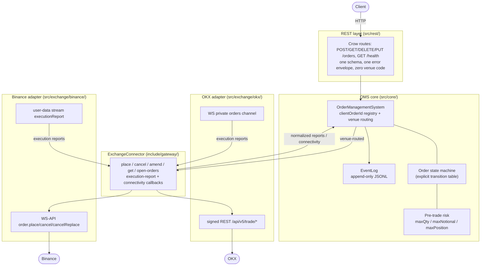

# Architecture — rest_exchange_gateway

Exchange-agnostic order REST gateway routing a unified client schema to OKX and Binance. Source of truth: `doc/project-spec.md`; C++ rules: `doc/code-guidelines.md`.

## Layers



1. **REST layer** (`src/rest/`, public headers in `include/gateway/`)
   - Single client-facing API; identical request/response schema regardless of venue.
   - Clients never send exchange-specific fields.
2. **Core** (`src/core/`)
   - Unified order model + order state machine.
   - `clientOrderId → exchangeOrderId` mapping.
   - Pre-trade risk checks: max order size per instrument, max notional per order, per-instrument position limit (approximate). Rejections return clear reasons.
   - Append-only persistence log for restart recovery.
3. **Exchange adapters** (`src/exchange/<venue>/`)
   - Isolated behind one common interface (`IExchange` or concept-based).
   - OKX: REST for order entry / cancel / amend; WebSocket for order and trade updates.
   - Binance: WebSocket-based order submission; WebSocket subscriptions for execution updates.

## Rules

- Exchange-specific code lives only inside its adapter subdirectory and is never referenced from the REST layer.
- Common order schema: `clientOrderId`, `venue` (OKX | BINANCE), `symbol`, `side`, `type` (Market/Limit), `price`, `quantity`, `timeInForce`.
- Normalized execution states: New/Live, Partially Filled, Filled, Canceled, Rejected. Mapping between client-level concepts and exchange-specific semantics must be explicit.

## Robustness Requirements

- Handle out-of-order WebSocket messages, duplicate execution reports, and REST vs WebSocket race conditions.
- Idempotent with respect to client retries.
- WebSocket disconnect/reconnect handling.
- On startup: reload persisted orders, reconcile with OKX open orders, re-establish Binance WebSocket state.

Diagrams: architecture above; order state machine, place idempotency
sequence and restart-recovery sequence in `doc/api.md`.

## External APIs (implementation must be based on the official docs)

- OKX API v5: https://my.okx.com/docs-v5/en/
- Binance Spot WebSocket API: https://developers.binance.com/docs/binance-spot-api-docs/web-socket-streams

## Out of Scope (per spec)

- Secure auth/key management (discussion only), UI/frontend, full exchange feature coverage, ultra-low-latency optimization.

## Project Layout

```
include/gateway/          # Public headers (the 1-REST surface)
src/
  core/                   # Shared types, config, logging, metrics
  exchange/               # One subdirectory per exchange (okx/, binance/, ...)
  rest/                   # Unified REST handlers
tests/
```
